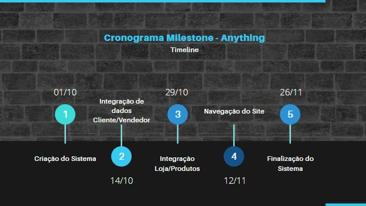

# TERMO DE ABERTURA DE PROJETO

|  DATA 	|   VERSÃO	| DESCRIÇÃO | AUTOR
|---	|---	|---  |--- |
| 08/10/2020 | 1.0 | Documento inicial | Porfirio Amaro de A. Junior|
| 13/10/2020 | 1.1 | Completando sessões | Jhonatas I. C. Laurentino e José Erildo|

#### 1. Equipe e definição de papéis

|  EQUIPE 	|   PAPEL	| E-MAIL | 
|---	|---	|---  |
| Jhonatas I. C. Laurentino | Analista e Design| costajhonatas9@gmail.com | 
| José Erildo Ramos | Gerente | joseerildo007@gmail.com |
| Marcelo Raí | Analista | marcelorai1@hotmail.com |
| Porfírio Amaro de Araujo Jr. | Analista | porfirioamarojr@gmail.com | 

#### 2. Objetivos do projeto
&nbsp;&nbsp;&nbsp;&nbsp;&nbsp;O Sistema Anything é um software de gerenciamento de e-commerce para pequenos empreendedores da região seridoense que será usado para auxílio na gerência de vendas de produtos.

#### 3. Justificativa do projeto
&nbsp;&nbsp;&nbsp;&nbsp;&nbsp;Com o objetivo de expandir a cultura seridoense para todo o Brasil, o projeto Anything vem trazendo produtos típicos e produzidos por pequenos empreendedores  e artesãos da região  Seridoense. Para ajudar assim na disseminação dos trabalhos desenvolvidos e também como fator de geração de renda para os produtores, expandindo assim sua área de clientes.

#### 4. Descrição dos produtos/entregáveis do projeto.
&nbsp;&nbsp;&nbsp;&nbsp;&nbsp;&nbsp;&nbsp;&nbsp;&nbsp;&nbsp;Release 01:  
  
&nbsp;&nbsp;&nbsp;&nbsp;&nbsp;&nbsp;&nbsp;&nbsp;&nbsp;&nbsp;Módulo de cadastro de cliente  
&nbsp;&nbsp;&nbsp;&nbsp;&nbsp;&nbsp;&nbsp;&nbsp;&nbsp;&nbsp;Módulo de cadastro de vendedor  
&nbsp;&nbsp;&nbsp;&nbsp;&nbsp;&nbsp;&nbsp;&nbsp;&nbsp;&nbsp;Módulo de cadastro de produto  
&nbsp;&nbsp;&nbsp;&nbsp;&nbsp;&nbsp;&nbsp;&nbsp;&nbsp;&nbsp;Módulo do Usuário  
  
&nbsp;&nbsp;&nbsp;&nbsp;&nbsp;&nbsp;&nbsp;&nbsp;&nbsp;&nbsp;Release 02:  
  
&nbsp;&nbsp;&nbsp;&nbsp;&nbsp;&nbsp;&nbsp;&nbsp;&nbsp;&nbsp;Módulo de pagamento  
&nbsp;&nbsp;&nbsp;&nbsp;&nbsp;&nbsp;&nbsp;&nbsp;&nbsp;&nbsp;Módulo de pesquisa  
&nbsp;&nbsp;&nbsp;&nbsp;&nbsp;&nbsp;&nbsp;&nbsp;&nbsp;&nbsp;Módulo de visualização  
&nbsp;&nbsp;&nbsp;&nbsp;&nbsp;&nbsp;&nbsp;&nbsp;&nbsp;&nbsp;Módulo de perfil  

#### 5. Restrições para o projeto
&nbsp;&nbsp;&nbsp;&nbsp;&nbsp;O sistema deve funcionar totalmente on-line, utilizando de ferramentas de gerenciamento  e análise de estatísticas  de banco de dados para auxiliar na tomada de decisões. 

#### 6. Cronograma de macros
  

#### 7. Partes Interessadas
Vendedores locais;  
Clientes regiões e nacionais;

#### 8. Riscos Identificados
| Risco  | Consequência  | Providência  | 
|---|---|---|
|  A não adequação por parte do vendedor ao nosso sistema. |  O vendedor não conseguirá usufruir de todas as funcionalidades e serviços prestados pela plataforma. |  O vendedor não conseguirá usufruir de todas as funcionalidades e serviços prestados pela plataforma. Chat de dúvidas;|
| Má conexão à internet  | Instabilidade no site  | Garantir assinatura em servidor confiável nacional;  | 
|  Quebra de segurança. |  Risco aos dados dos usuários | Controle de acesso ao servidor, | 
|  Má qualificação de pessoas que dão suporte ao sistema; | Atendimento não qualificado; Reclamações; Perda de clientes; | Treinamento de equipe; |
|  Poucos métodos de pagamento; | Não compra de produto devido o site não oferecer opção de boleto, bandeira de cartão ou outro meio;  |  Permitir todos os métodos de pagamento mais utilizados. |

