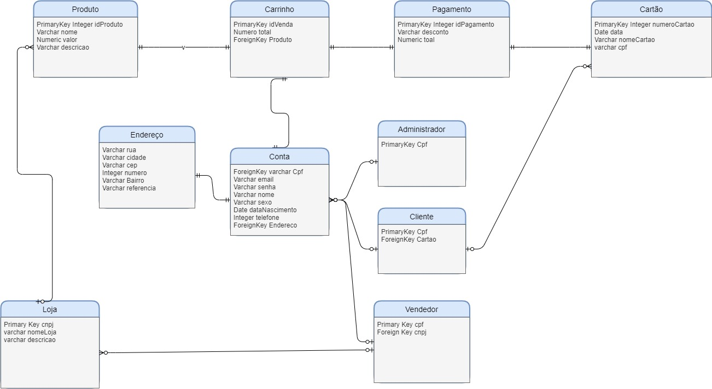

# Documento de Modelos

## Entidades  
* Produto - Apresenta dados referentes ao produto: nome, descrição e valor;
* Carrinho - Contém valor subtotal de todos os itens passados ao carrinho;
* Pagamento - Contém o valor total da compra, se houve cupom de desconto e método de pagamento;
* Cartão - Contém informações relevantes ao cartão de crédito do Cliente;
* Conta - Contém informações pessoais em comum de dos usuários Cliente e Administrador;
* Endereço - Informações de localidade da conta dos usuários;
* Cliente - Usuário que compra;
* Administrador - Usuário com maiores prioridades;
* Vendedor - Usuário que tem prioridade de cadastrar produtos;
* Loja - Pertence ao usuário vendedor, que tem os produtos que foram cadastrados.

## Modelo Conceitual

Segue em anexo a representação gráfica do modelo gerado a partir do yUML:

O código referente ao diagrama:

[Código UML](diagramas/MODELO_CONCEITUAL.md)

Para mais informações sobre a utilização do yUML acesse o link:

[Tutorial](https://yuml.me/diagram/plain/class/samples)  

## Modelo de Dados

Representação de Modelo gerado pelo Draw.io:

  

Conteúdo de Leitura
  
[Tutorial](https://www.devmedia.com.br/modelagem-de-dados-tutorial/20398)

## Dicionário de Dados

Um dicionário de dados é uma coleção de metadados que contêm definições e representações de elementos de dados. O paradigma utilizado no projeto para a representação dos dados é representado nas tabelas abaixo:

### Entidade: Cliente

 Atributo | Tipo de chave | Tipo de dado | Restrição | Observação | Relacionamento | Descrição 
 -------- | ------------- | ------------ | --------- | ---------- | -------------- | ---------
 cpf      | primary key   | Numérico     | Não pode ser nulo. | Apenas números | Conta e Cartão | Tabela para registro de clientes.
 cartao   | foreign key   | Numérico     | Não pode ser nulo. | Apenas números |

### Entidade: Administrador

 Atributo | Tipo de chave | Tipo de dado | Restrição | Observação | Relacionamento | Descrição
 -------- | ------------- | ------------ | --------- | ---------- | -------------- | ---------
 cpf      | primary key   | Numérico    | Não pode ser nulo. | Apenas números | - | Conta | Tabela para registro de administrador(es)

### Entidade: Conta

 Atributo | Tipo de chave | Tipo de dado | Restrição | Observação | Relacionamento | Descrição
 -------- | ------------- | ------------ | --------- | ---------- | -------------- | ---------
 cpf      | foreign key   | Numérico     | Não pode ser nulo. | Apenas números | Administrador, Cliente, Vendedor, Carrinho e Endereço | Tabela para registro de conta
 email    |      -        | Alfanumérico | Não pode ser nulo. | - |
 senha | - | Alfanumérico | Não pode ser nulo. | - |
 nome | - | Texto | Não pode ser nulo. | - |
 sexo | - | Texto | Não pode ser nulo. | - |
 data_nascimento | - | Data | Não pode ser nulo. | - |
 telefone | - | Numérico | Não pode ser nulo. | - |
 endereco | foreign key | Endereço | Não pode ser nulo. | - |

### Entidade: Endereço

 Atributo | Tipo de chave | Tipo de dado | Restrição | Observação | Relacionamento | Descrição
 -------- | ------------- | ------------ | --------- | ---------- | -------------- | ---------
 rua | - | Alfanumérico | Não pode ser nulo. | - | Conta | Tabela para cadastro de endereço
 cidade | - | Alfanumérico | Não pode ser nulo. | - |
 numero | - | Numérico | Não pode ser nulo. | - |
 bairro | - | Alfanumérico | Não pode ser nulo. | - |
 cep | - | Numérico | Não pode ser nulo. | - |
 referencia | - | Alfanumérico | - | - |

### Entidade: Carrinho

 Atributo | Tipo de chave | Tipo de dado | Restrição | Observação | Relacionamento | Descrição
 -------- | ------------- | ------------ | --------- | ---------- | -------------- | ---------
 id_vendas | primary key | Numérico | Não pode ser nulo. | Auto-incremento | Conta, Pagamento e Produto | Tabela para adicionar itens em uma compra
 total | - | Numérico | Não pode ser nulo. | Apenas números |
 produto | foreign key | Texto | Não pode ser nulo. | - |

### Entidade: Produto

 Atributo | Tipo de chave | Tipo de dado | Restrição | Observação | Relacionamento | Descrição
 -------- | ------------- | ------------ | --------- | ---------- | -------------- | ---------
 id_produtos | primary key | Numérico | Não pode ser nulo. | Auto-incremento | Carrinho e Loja | Tabela para cadastro de produtos
 nome | - | Numérico | Não pode ser nulo. | Apenas números |
 valor | - | Real | Não pode ser nulo. | Apenas números |
 descricao | - | Texto | - | - |

### Entidade: Pagamento

 Atributo | Tipo de chave | Tipo de dado | Restrição | Observação | Relacionamento | Descrição
 -------- | ------------- | ------------ | --------- | ---------- | -------------- | ---------
 id_pagamento | primary key | Numérico | Não pode ser nulo. | Auto-incremento | Cartão e Carrinho | Tabela responsável pelos registros de pagamento
 desconto | - | Numérico | Não pode ser nulo. | Apenas números |
 total | - | Real | Não pode ser nulo. | Apenas números |

### Entidade: Cartão

 
 Atributo | Tipo de chave | Tipo de dado | Restrição | Observação | Relacionamento | Descrição
 -------- | ------------- | ------------ | --------- | ---------- | -------------- | ---------
 numero_cartao | primary key | Numérico | Não pode ser nulo. | Apenas números | Pagamento e Cliente | Tabela para cadastro de um cartão para o cliente
 data | - | Data | Não pode ser nulo. | Apenas números |
 nome_cartao | - | Numérico | Não pode ser nulo. | Apenas números |
 cpf | - | Numérico |Não pode ser nulo. | Apenas números |
 
 
 ### Entidade: Vendedor

 
 Atributo | Tipo de chave | Tipo de dado | Restrição | Observação | Relacionamento | Descrição
 -------- | ------------- | ------------ | --------- | ---------- | -------------- | ---------
 cpf | - | Numérico | Não pode ser nulo. | Apenas números | - | Conta e loja | Tabela para registro de vendedores
 cnpj | - | Numérico | Não pode ser nulo. | Apenas números |
 
 
 ### Entidade: Loja

 
 Atributo | Tipo de chave | Tipo de dado | Restrição | Observação | Relacionamento | Descrição
 -------- | ------------- | ------------ | --------- | ---------- | -------------- | ---------
 cnpj | - | Numérico | Não pode ser nulo. | Apenas números | - | Produto e Vendedor | Tabela para registro de lojas no sistema
 nome_loja | - | Texto | Não pode ser nulo. | - |
 descricao | - | Texto | Não pode ser nulo. | - |
