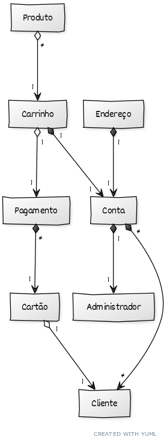

# Documento de Modelos

## Entidades  
* Produto - apresenta dados referentes ao produto: nome, descrição e valor;
* Carrinho - contém valor subtotal de todos os itens passados ao carrinho;
* Pagamento - contém o valor total da compra, se houve cupom de desconto e método de pagamento;
* Cartão - contém informações relevantes ao cartão de crédito do Cliente;
* Conta - contém informações pessoais em comum de dos usuários Cliente e Admnistrador;
* Endereço - Informações de localizadade da Coonta dos usuários;
* Cliente - usuário que compra;
* Admnistrador = usuário com maiores prioridades;

## Modelo Conceitual

Segue em anexo a representação gráfica do modelo gerado a partir do yUML:

O código referente ao diagrama:

[Código UML](diagramas/MODELO_CONCEITUAL.md)

Para mais informações sobre a utilização do yUML acesse o link:

[Tutorial](https://yuml.me/diagram/plain/class/samples)  

## Modelo de Dados

Representação de Modelo gerado pelo Draw.io:

  

Conteúdo de Leitura
  
[Tutorial](https://www.devmedia.com.br/modelagem-de-dados-tutorial/20398)

