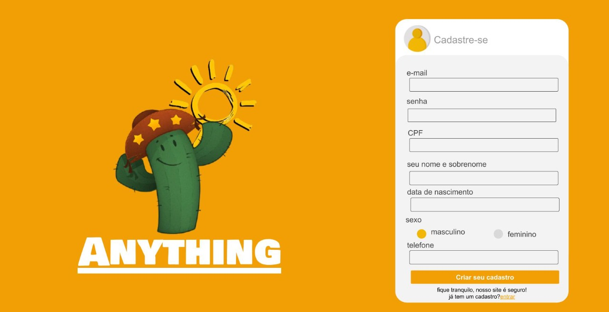

# Anything - Documento com a Lista de User Stories.

Este documento descreve os User Stories criados a partir da Lista de Requisitos no Documento 001 - Documento de Visão. Este documento também pode ser adaptado para descrever Casos de Uso. Modelo de documento baseado nas características do processo easYProcess (YP).

### Histórico de Revisões do Modelo  

Data | Versão | Descrição | Autor 
 -------- | ----------- | ---------- | ------------ 
 08/10/2020      | 1.0  | Documento inicial | José Erildo
 27/10/2020      | 1.1  | Descrições em andamento | Marcelo Raí
 30/10/2020      | 1.2  | Adiçao do US003 | Jhonatas Laurentino 
 
 
### Prioridade do User Story  
&nbsp;&nbsp;&nbsp;&nbsp;&nbsp;Prioridade do User Story ou dos Requisitos: A prioridade dos requisitos é utilizada no gerenciamento do escopo das etapas do projeto e na definição das prioridades durante o desenvolvimento do sistema.  
&nbsp;&nbsp;&nbsp;&nbsp;&nbsp;**Essencial:** requisito sem o qual o sistema não entra em funcionamento. Requisitos essenciais são requisitos imprescindíveis para o funcionamento do sistema.  
&nbsp;&nbsp;&nbsp;&nbsp;&nbsp;**Importante:** requisito sem o qual o sistema entra em funcionamento, mas de forma não satisfatória. Requisitos importantes devem ser implantados o mais rápido possível, mas, se não forem, parte do sistema poderá ser implantada mesmo assim.  
&nbsp;&nbsp;&nbsp;&nbsp;&nbsp;**Desejável:** requisito que não compromete as funcionalidades básicas do sistema, isto é, o sistema pode funcionar de forma satisfatória sem ele. Requisitos desejáveis são requisitos que podem ser implantados por último, sem comprometer o funcionamento do sistema.  
 
 ### Lista de User Stories
   
### User Story US00 - Cadastro de Dados Pessoais do Usuário

| **Descrição**  | O sistema deve manter um cadastro de dados pessoais do usuário e armazená-lo no banco de dados para em seguida ter acesso ao sistema via login e senha. Um usuário tem os atributos nome, endereço, email, senha, cpf, idade, Sexo, data de nascimento e telefone.
|---|---|
|  **Requisitos Envolvidos**  | RF002, RF003, RF004  |
|   **Prioridade**  |  Essencial |
|  **Estimativa**  |  5h  |
|  **Tempo Gasto Real:** |   | 
|  **Tamanho Funcional**  |   |  

### Testes de Aceitação (TA)
| Código | Descrição |
|---|---|
|  **TA01.01**  | O usuário informa, na tela Registrar, todos os dados para registrar-se corretamente, ao clicar em salvar ele é redirecionado para uma nova tela na qual cadastrará seu endereço.  |
|   **TA01.02**  | O usuário informa, na tela Registrar, os dados para registrar-se incorretamente, ao clicar em salvar ele é notificado com uma mensagem de erro. |
 
### User Story US01 - Cadastro de Endereço do Usuário

| **Descrição**  | Após cadastrar os dados pessoais, o usuáro será redirecionado para uma nova tela na qual irá cadastrar dados de endereço: rua, cidade, cep, numero, bairro, referência.
|---|---|
|  **Requisitos Envolvidos**  | RF002, RF003  |
|   **Prioridade**  |  Essencial |
|  **Estimativa**  |  5h  |
|  **Tempo Gasto Real:** |   | 
|  **Tamanho Funcional**  |   |  

### Testes de Aceitação (TA)
| Código | Descrição |
|---|---|
|  **TA01.01**  | O usuário informa na tela, todos os dados para registrar o endereço corretamente, ao clicar em salvar ele receberá uma mensagem de confirmação de "Cadastro Completo". |
|   **TA01.02**  | O usuário informa, na tela de registrar endereço, os dados para registrar  incorretamente, ao clicar em salvar ele é notificado com uma mensagem de erro. |
 
### User Story US02 - Login do Usuário

| **Descrição**  | Após o cadastro de dados pessoais o  usuário estará habilidade para fazer login |
|---|---|
|  **Requisitos Envolvidos**  | RF002, RF005  |
|   **Prioridade**  |  Essencial |
|  **Estimativa**  |  5h  |
|  **Tempo Gasto Real:** |   | 
|  **Tamanho Funcional**  |   |  

### Testes de Aceitação (TA)
| Código | Descrição |
|---|---|
|  **TA01.01**  | O usuário informa corretamente na tela seu email e senha e entra no sistema |
|   **TA01.02**  | O usuário informa incorretamente na tela seu email e senha para entrar no sistema e recebe mensagem de erro|
| **TA01.03** | Caso o usuário faça mais de uma tentativa de acesso e tenha esquecido a senha, poderá enviar solicitação para alteração via e-mail, logo em seguida poderá fazer login novamente e ter acesso ao sistema normalmente. |

### Tela 00

### User Story US03 - Cadastro de produtos

| **Descrição**  | CRUD com os dados dos produtos que serão vendidos no sistema
|---|---|
|  **Requisitos Envolvidos**  | RF001 |
|   **Prioridade**  |  Essencial |
|  **Estimativa**  |  7h  |
|  **Tempo Gasto Real:** |   | 
|  **Tamanho Funcional**  |   |  

### Testes de Aceitação (TA)
| Código | Descrição |
|---|---|
|  **TA03.01**  | O vendedor irá cadastrar os dados do referente produto, não pode cadastrar mais de um produto do mesmo |
|   **TA03.02**  |Todos produtos terão uma chave primaria unica, a qual será usada no CRUD |

.jpg)
